# 03-流程图 V0.2 最终版：教育直播竞品情报与话术优化 Agent

## 文档用途

本文件是 [02-工作流卡片.md](/Volumes/ExternalStorage/agent架构师/教育直播竞品情报Agent/02-工作流卡片.md) 的高层可视化表达。详细业务规则、RFC 2119要求、失败处理、状态、数据血缘、幂等和恢复原则以 `02-工作流卡片.md` 为准。

## 最终 Mermaid

```mermaid
flowchart TD

%% =========================
%% 商品接入与同行持续发现
%% =========================
subgraph A["商品接入与同行持续发现"]
    F0["用户通过飞书提交5元教育课包商品链接"]
    A0["接收商品任务"]
    A1["读取已登录的巨量百应浏览器环境"]
    A2{"登录状态是否有效？"}
    HLOGIN["人工处理登录、扫码、验证码或风控"]
    HRES["处理完成后从原中断节点恢复"]

    A3["幂等建立或读取商品任务"]
    A4["完整扫描商品对应同行结果"]
    A5{"能否证明平台不存在更多结果<br/>并已读取全部同行？"}

    A6["标记本轮扫描不完整<br/>保存可确认的数据和诊断信息<br/>不增加未出现计数<br/>不得判断关系退出"]
    A6D{"该商品是否已经完成<br/>首次正式完整建档？"}
    A6F["首次建档尚未完成<br/>不生成首次完整建档Checkpoint<br/>等待重试或下一次完整扫描"]
    A6P["仅记录本轮周期扫描不完整<br/>不破坏既有商品、同行及监控状态"]

    AWAIT["按后续配置周期或重试条件<br/>等待下一轮完整扫描"]

    A7["按账号ID识别、去重并更新同行身份"]
    A8{"本轮完整扫描中<br/>该商品 × 同行关系是否出现？"}

    A9["新增、持续或重新出现<br/>更新商品关系<br/>未出现计数归零"]
    A10["连续未出现计数 +1"]
    A11{"是否达到连续10次<br/>有效完整扫描未出现？"}
    A12["保持当前商品关系历史状态<br/>不标记“不再出现”<br/>飞书回写本次计数"]
    A13["商品 × 同行关系标记为<br/>不再出现／当前未带该商品"]
    ASEP["商品关系状态与账号监控状态分离<br/>关系不再出现时默认仍继续监控"]

    A16["飞书正式回写同行身份、商品关系及历史变化"]
    P0["生成首次完整建档Checkpoint<br/>启动或幂等维持两个并行长期循环"]
end

F0 --> A0 --> A1 --> A2
A2 -->|是| A3 --> A4 --> A5
A2 -->|否| HLOGIN --> HRES
HRES -.从原中断节点恢复.-> A1

A5 -->|否| A6 --> A6D
A6D -->|首次建档尚未完成| A6F --> AWAIT
A6D -->|此前已经完成建档| A6P --> AWAIT
A6P -.既有开播监控继续运行.-> B0

A5 -->|是| A7 --> A8
A8 -->|出现| A9 --> A16
A8 -->|未出现| A10 --> A11
A11 -->|未达到10次| A12 --> A16
A11 -->|达到10次| A13 --> ASEP --> A16

A16 --> P0
P0 --> AWAIT
AWAIT --> A1


%% =========================
%% 开播监控与录制
%% =========================
subgraph B["账号开播持续监控与直播录制"]
    B0["维护独立的账号监控状态与同行热度排序<br/>依据：最近是否开播、最近一周开播频率<br/>排名靠后不得停止监控"]
    B1["持续检测账号开播状态<br/>正常目标周期约30秒<br/>异常时可退避至60～180秒"]
    B2{"开播状态检测结果？"}

    B2U["UNKNOWN／检测失败<br/>MUST NOT记录为未开播"]
    B2R["自动重试或按已有规则退避<br/>恢复后继续检测"]

    B3["明确开播且直播入口可用<br/>幂等创建或复用该次直播的唯一场次"]
    B4["尝试启动原场次录制"]
    B4S{"录制是否启动成功？"}
    B4W{"是否仍处于3分钟重试窗口？"}
    B4D["等待30秒"]
    B4H["WAITING_HUMAN<br/>飞书通知用户<br/>保留原场次，不创建第二场次"]
    HREC["人工处理录制异常"]

    B5["持续录制整场直播"]
    B6{"是否疑似下播或直播中断？"}
    B7["等待5分钟确认是否恢复"]
    B8{"5分钟内是否恢复？"}
    B9["确认本场结束<br/>保存实际录制结果并更新场次状态"]
end

P0 --> B0 --> B1
B1 --> B2

B2 -->|明确未开播| B1
B2 -->|检测失败／未知| B2U --> B2R --> B1
B2 -->|明确开播且入口可用| B3 --> B4 --> B4S

B4S -->|成功| B5
B4S -->|失败| B4W
B4W -->|是| B4D --> B4
B4W -->|连续3分钟仍失败| B4H --> HREC --> B4

B5 --> B6
B6 -->|否| B5
B6 -->|是| B7 --> B8
B8 -->|恢复| B5
B8 -->|未恢复| B9

B1 -.登录失效／验证码／风控.-> HLOGIN
HRES -.从监控中断节点恢复.-> B1
B9 -.更新热度并继续长期监控.-> B0


%% =========================
%% 转录与场次处理
%% =========================
subgraph C["转录、归档与场次分析分流"]
    C0["Step 9：生成音频与带时间戳原始逐字稿"]
    CT{"转录是否成功？"}
    CTF["保留录像、音频和场次记录<br/>重试或进入人工处理"]

    C1{"关键ASR内容是否可以可靠确认？"}
    HASR["人工核验疑似文本<br/>提供原始时间戳及前后各一分钟上下文"]
    HASRQ{"人工核验后<br/>是否能够可靠确认？"}
    HASRC["修正对应文本及文本版本"]
    HASRU["标记为低置信度／无法确认／证据不足<br/>保存疑似文本、原始时间戳、前后上下文和媒体入口<br/>MUST NOT用该不确定证据形成确定结论"]

    C1A["生成清洗稿<br/>保留有业务意义的口语、语气和表达<br/>保留低置信度及证据不足标记"]
    C1B["完成归档及飞书交付<br/>飞书可直接查看最近两场完整逐字稿、清洗稿、分析、比较、变化和审核入口<br/>Obsidian保留长文本真本<br/>本地媒体仓库保留视频和音频"]

    C2{"Step 10：当前场次是否为可用完整场？<br/>累计漏录≤3分钟且不影响整体时可标记完整并注明缺口<br/>累计漏录＞3分钟标记部分录制<br/>商品承接或成交部分漏录必须明确标记"}

    CP["部分录制场次辅助分析<br/>仅提取有明确证据的观察<br/>全部结论标记来源于部分录制"]
    CPE["飞书回写部分场次结果<br/>不替代最新或上一完整场<br/>不推动正式打法版本升级"]

    C3{"是否存在上一场可用完整直播？"}
    C4["建立首个完整基准场<br/>完成单场拆解与分析<br/>不生成N vs N-1比较<br/>初始打法基线进度1/3<br/>仅使用可确认内容，候选策略标记为单场观察"]

    C5["Step 11：最新完整场 N<br/>VS 上一完整场 N-1<br/>执行分模块比较"]
    CJ{"模块拆解、商品归属及关键判断<br/>能否可靠完成？"}
    HJ["人工处理关键判断<br/>能够确认则修正<br/>仍不能确认则保留证据不足状态"]
    HJOBS["依赖该证据的模块、版本或策略判断<br/>标记证据不足／继续观察<br/>不形成确定结论"]
    CM["新真实完整场分析结果<br/>固定讲解、干货、需求、信任、商品承接、成交推动、答疑及闲聊已区分<br/>只有可靠证据参与确定判断"]

    WREAL["等待下一场真实直播事件"]
end

B9 --> C0 --> CT
CT -->|失败| CTF --> C0
CT -->|成功| C1

C1 -->|是| C1A
C1 -->|否| HASR --> HASRQ
HASRQ -->|能够确认| HASRC --> C1A
HASRQ -->|仍无法确认| HASRU --> C1A

C1A --> C1B --> C2

C2 -->|否：部分录制| CP --> CPE --> WREAL
C2 -->|是：可用完整场| C3
C3 -->|否| C4
C3 -->|是| C5 --> CJ

CJ -->|是| CM
CJ -->|否| HJ
HJ -->|能够确认| CM
HJ -->|仍无法确认| HJOBS --> WREAL
HJOBS -.其他不依赖该证据的观察可继续.-> SENTRY

C1B -.所有完整场及部分场统一登记素材生命周期.-> L0
WREAL -.下一场必须来自真实开播事件.-> B1


%% =========================
%% 打法版本验证
%% =========================
subgraph D["真实完整场驱动的话术打法版本演进"]
    DI1["首个完整基准场<br/>建立初始打法基线1/3<br/>不代表打法已经稳定"]

    DFIX["更新固定讲解连续3场验证状态"]
    DSTATE{"当前是否处于初始打法基线验证期？"}

    DICONT{"本场是否继续符合<br/>初始基线结构与关键逻辑？"}
    DIPROG["初始基线连续验证进度 +1"]
    DIREACH{"是否达到3个真实可用完整场？"}
    DCONF["从第3个符合条件的完整场确认V1"]
    DIRESET["终止当前连续验证<br/>以本场重新建立基线1/3<br/>或继续观察"]

    DIA{"当前是否存在正在验证的<br/>疑似新打法候选？"}
    DCONT{"本场是否继续符合该候选的<br/>新结构或关键逻辑？"}
    DPROG["疑似新打法候选<br/>连续验证进度 +1"]
    DREACH{"是否达到3个真实可用完整场？"}
    DHIST{"是否匹配某个历史已确认打法版本？"}
    DREST["从第3个符合条件的完整场<br/>确认恢复历史版本"]
    DNEW["从第3个符合条件的完整场<br/>确认新的话术打法版本"]
    DSTOP["终止原疑似新打法候选"]

    D0{"本场相对当前正式打法<br/>是否发生结构或关键逻辑实质变化？"}
    DC["继续沿用当前正式打法版本"]
    DCAND["建立新的疑似打法候选1/3"]
end

C4 --> DI1 --> WREAL

CM --> DFIX --> DSTATE
DSTATE -->|是| DICONT
DICONT -->|是| DIPROG --> DIREACH
DIREACH -->|否| WREAL
DIREACH -->|是| DCONF --> WREAL
DICONT -->|否| DIRESET --> WREAL

DSTATE -->|否：已有正式版本| DIA

DIA -->|存在候选| DCONT
DCONT -->|继续符合| DPROG --> DREACH
DREACH -->|否| WREAL
DREACH -->|是| DHIST
DHIST -->|是| DREST --> WREAL
DHIST -->|否| DNEW --> WREAL

DCONT -->|不再符合| DSTOP --> D0

DIA -->|不存在候选| D0
D0 -->|否| DC --> WREAL
D0 -->|是| DCAND --> WREAL


%% =========================
%% 策略候选验证
%% =========================
subgraph S["竞品策略候选与连续3场验证"]
    SENTRY{"本场是否发现值得进入候选库的<br/>有证据策略观察？"}
    S0["生成竞品策略候选<br/>保存同行、场次、时间戳和原始证据<br/>对每条候选独立追踪"]

    SEV{"证据是否充分且可追溯？"}
    SOB["标记继续观察<br/>不得输出确定策略"]
    SEXIST{"是否已有对应策略候选<br/>处于连续验证中？"}
    SBASE["建立策略候选验证进度1/3"]
    SCONT{"本场真实完整直播<br/>是否再次出现同一策略？"}
    SPROG["候选策略连续验证进度 +1"]
    SREACH{"是否达到同一同行连续3个<br/>真实可用完整场？"}
    SSTABLE["确认稳定候选策略"]
    SSTOP["终止原候选连续计数<br/>按本场证据重新建立候选或继续观察"]

    HTEST["人工闸门：是否值得测试？"]
    SREJ["记录拒绝或继续观察结果"]
end

C4 --> SENTRY
CM --> SENTRY

SENTRY -->|否| WREAL
SENTRY -->|是| S0 --> SEV
SEV -->|否| SOB --> WREAL
SEV -->|是| SEXIST

SEXIST -->|否| SBASE --> WREAL
SEXIST -->|是| SCONT
SCONT -->|是| SPROG --> SREACH
SREACH -->|否| WREAL
SREACH -->|是| SSTABLE --> HTEST
SCONT -->|否| SSTOP --> WREAL

HTEST -->|拒绝／继续观察| SREJ --> WREAL


%% =========================
%% 知识优化与人工审批
%% =========================
subgraph K["正式知识比较、使用保护、Diff与人工审批"]
    K0["Step 14：重新读取当前最新正式知识版本<br/>及其数据血缘与复核状态"]
    KR{"本次知识比较是否依赖<br/>REVIEW_REQUIRED知识项？"}
    KRB{"业务是否明确必须继续使用？"}
    KP["优先暂停使用受影响知识项<br/>WAITING_HUMAN"]
    KRF["显式携带“该知识正在复核”风险状态<br/>不得静默视为完全可靠"]

    K1["将已验证候选策略<br/>与当前可用正式知识比较"]
    K2["生成可追溯话术Diff<br/>记录候选策略、场次证据<br/>及所比较的正式知识版本"]
    HAPP["人工审批闸门<br/>采用／拒绝／修改／继续观察"]
    K5["记录人工决定与反馈"]

    K3["Step 15：按人工批准结果<br/>幂等创建并写入新的正式知识版本<br/>更新关系、状态和操作记录"]
    KQ{"正式知识新版本是否写入成功？"}
    KERR["保留审批结果与已有成果<br/>标记更新失败并从安全节点恢复"]
    K4["基于最新正式知识版本<br/>生成新版原创直播话术"]
    HUSE["人工决定是否投入真实直播"]
end

HTEST -->|值得测试| K0
K0 --> KR
KR -->|否| K1
KR -->|是| KRB
KRB -->|否| KP --> HR
KRB -->|业务明确必须继续| KRF --> K1

K1 --> K2 --> HAPP
HAPP -->|拒绝／继续观察| K5
HAPP -->|要求修改| K2
HAPP -->|批准| K3 --> KQ

KQ -->|失败| KERR --> K3
KQ -->|成功| K4 --> HUSE


%% =========================
%% 素材生命周期
%% =========================
subgraph L["独立素材生命周期与关键证据包"]
    LREQ["登记该场：需要关键证据包 = 是<br/>仅登记需求，不触发清理流程"]

    L0["Step 16：登记完整场或部分场的<br/>统一重素材生命周期状态"]
    LR{"适用的分析、版本、策略<br/>及飞书回写是否已经完成？"}
    LWAIT["保持素材并等待前置处理完成<br/>不阻塞监控、分析、审批或知识更新"]

    L1{"是否属于最近两场完整重素材<br/>或被人工标记为长期保留？"}
    LKEEP["继续保留并在后续重新评估"]

    L2{"该场是否登记了<br/>必须长期保留的关键证据？"}
    L3["创建关键证据包<br/>保存关键原话、上下文、时间戳、来源版本<br/>对应策略、打法版本及采用状态"]
    L4{"证据包是否保存成功<br/>且能够回溯核验？"}
    LFAIL["阻止清理<br/>保留完整重素材<br/>等待修复后重新验证"]

    L5["标记为待清理"]
    L6["进入3天缓冲期"]
    L7{"缓冲结束后<br/>清理条件是否仍然满足？"}
    L8["清理旧录像、音频和完整长文本重素材"]
    L9["长期保留场次、版本、变化、策略、审核、影响记录<br/>以及已验证的关键证据包"]
end

DNEW -.登记证据包需求.-> LREQ
S0 -.登记证据包需求.-> LREQ
K2 -.登记对应来源场次的证据包需求.-> LREQ
K3 -.登记对应来源场次的证据包需求.-> LREQ

L0 --> LR
LR -->|否| LWAIT --> LR
LR -->|是| L1

L1 -->|是| LKEEP
LKEEP -.后续重新评估.-> LR

L1 -->|否| L2
L2 -->|需要| L3 --> L4
L4 -->|失败| LFAIL --> L3
L4 -->|成功| L5
L2 -->|不需要| L5

L5 --> L6 --> L7
L7 -->|否| LWAIT
L7 -->|是| L8 --> L9


%% =========================
%% 数据血缘、STALE与复核
%% =========================
subgraph X["数据血缘、下游失效传播与正式知识复核"]
    XLIN["关键产物保存来源商品、同行、场次、媒体、逐字稿版本<br/>清洗稿版本、比较版本、打法版本、候选策略及正式知识版本"]

    X0["上游证据或数据版本发生修正"]
    X1{"属于无业务影响修改<br/>还是实质修改？"}
    XNI["更新版本及操作记录<br/>可不触发全部下游重算"]

    XST["执行数据血缘影响检查<br/>将受影响下游标记为STALE／待重算"]
    XF{"是否影响已经批准的正式知识项？"}
    XNOF["未受影响的正式知识继续正常使用"]
    XRR["将受影响的具体正式知识项标记为<br/>REVIEW_REQUIRED／待复核<br/>不得自动删除或回滚"]
    HR["高优先级人工复核"]
    XDEC["按人工决定执行：保留／修正／撤销／创建替代版本<br/>记录结果，不自动回滚"]

    XE{"确定最早受影响节点"}

    X9["从Step 9<br/>转录或文本版本节点幂等重算"]
    X10["从Step 10<br/>完整场／部分场分支判断幂等重算"]
    X11["从Step 11<br/>模块拆解与场次比较节点幂等重算"]
    X12["从Step 12<br/>打法版本判断节点幂等重算"]
    X13["从Step 13<br/>候选策略节点幂等重算"]
    X14["从Step 14<br/>知识比较与Diff节点幂等重算"]
end

XLIN -.覆盖关键业务产物.-> X0
X0 --> X1
X1 -->|无业务影响| XNI
X1 -->|实质修改| XST

XST --> XE
XST --> XF

XF -->|否| XNOF
XF -->|是| XRR --> HR --> XDEC --> K0

XE -->|Step 9| X9 --> C0
XE -->|Step 10| X10 --> C2
XE -->|Step 11| X11 --> C5
XE -->|Step 12| X12 --> DSTATE
XE -->|Step 13| X13 --> S0
XE -->|Step 14| X14 --> K0


%% =========================
%% Runtime Observability
%% =========================
subgraph O["Runtime Observability／运行可观测性（横切整个主流程）"]
    O0["覆盖所有长期任务和关键业务节点"]
    O1["状态：IDLE／RUNNING／WAITING／WAITING_LLM／WAITING_TOOL<br/>WAITING_HUMAN／PAUSED／PARTIAL_SUCCESS／SUCCESS／FAILED／OFFLINE"]
    O2["持续记录：status、heartbeat、checkpoint、persistent log<br/>真实error_type、error_message及resume_from"]
    O3["恢复前读取最后状态、最后检查点、最新数据版本、血缘状态<br/>STALE、未完成写入、未完成证据包及待清理对象"]
end

O0 --> O1 --> O2 --> O3


%% =========================
%% 样式
%% =========================
classDef human fill:#ffe5e5,stroke:#cc0000,stroke-width:2px;
classDef decision fill:#fff4cc,stroke:#b8860b,stroke-width:1.5px;
classDef wait fill:#f2f2f2,stroke:#666666,stroke-dasharray:5 5;
classDef exception fill:#fff0e0,stroke:#d2691e,stroke-width:1.5px;
classDef relation fill:#f1e8ff,stroke:#7651a8,stroke-width:1.5px;
classDef monitor fill:#e4f7f7,stroke:#138a8a,stroke-width:1.5px;
classDef lifecycle fill:#ebf8e8,stroke:#39843c,stroke-width:1.5px;
classDef stale fill:#fff0dc,stroke:#c65d00,stroke-width:2px;
classDef review fill:#ffe3e3,stroke:#b30000,stroke-width:2px;
classDef cross fill:#ececff,stroke:#4a4a9f,stroke-width:1.5px;

class HLOGIN,HRES,HREC,HASR,HJ,HTEST,HAPP,HUSE,HR human;
class A2,A5,A6D,A8,A11,B2,B4S,B4W,B6,B8,CT,C1,HASRQ,C2,C3,CJ,DSTATE,DICONT,DIREACH,DIA,DCONT,DREACH,DHIST,D0,SENTRY,SEV,SEXIST,SCONT,SREACH,KR,KRB,KQ,LR,L1,L2,L4,L7,X1,XF,XE decision;
class AWAIT,A6F,A6P,B1,B2R,B4D,B4H,WREAL,KP,LWAIT,LKEEP,L6 wait;
class P0,B0 monitor;
class A9,A10,A12,A13,ASEP,A16 relation;
class B2U,CTF,HASRU,HJOBS,KERR,LFAIL exception;
class LREQ,L0,L3,L5,L8,L9 lifecycle;
class XST,X9,X10,X11,X12,X13,X14 stale;
class XRR,XDEC review;
class O0,O1,O2,O3,XLIN cross;
```

## 流程说明

- **两个并行长期循环**：商品同行持续扫描与同行账号开播监控在首次完整建档后并行运行，互不等待。单次周期扫描失败不会停止既有开播监控。
- **单场直播处理链**：明确开播后创建或复用唯一场次，启动并持续录制；下播经过5分钟确认后，进入转录、清洗、归档和飞书交付。
- **三类场次分支**：部分录制场只做有证据的辅助分析；首个完整场建立初始基线但不做N vs N-1；后续完整场进入N vs N-1模块比较。
- **连续3场验证**：固定讲解、话术打法版本和稳定候选策略的连续验证，均由后续真实可用完整直播场次推进，不是同一场数据的内部循环。
- **两个不同人工闸门**：用户先决定稳定候选策略是否“值得测试”，生成Diff后再决定是否批准进入正式知识库。批准后的机械写入可由Agent执行。
- **STALE与REVIEW_REQUIRED**：STALE用于上游实质修正后受影响下游分析的待重算状态；REVIEW_REQUIRED用于已批准正式知识证据失效后的待人工复核状态，系统不得自动回滚。
- **关键证据包与素材生命周期**：登记证据包需求不直接触发清理。旧重素材必须完成前置处理、避开最近两场和人工长期保留对象、必要时固化并验证证据包，再经过3天缓冲后清理。
- **Runtime Observability**：状态、心跳、Checkpoint、持久化日志、错误分类和恢复位置是覆盖全部长期任务及关键节点的横切能力，不是单独的业务主链。

